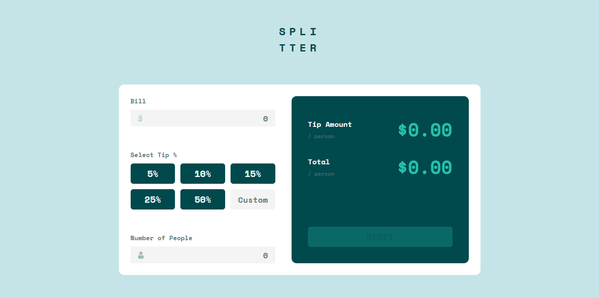

# Frontend Mentor - Tip calculator app solution

This is a solution to the [Tip calculator app challenge on Frontend Mentor](https://www.frontendmentor.io/challenges/tip-calculator-app-ugJNGbJUX). Frontend Mentor challenges help you improve your coding skills by building realistic projects.

## Table of contents

- [Overview](#overview)
  - [The challenge](#the-challenge)
  - [Screenshot](#screenshot)
  - [Links](#links)
- [My process](#my-process)
  - [Built with](#built-with)
  - [What I learned](#what-i-learned)
  - [Continued development](#continued-development)
- [Author](#author)

## Overview

### The challenge

Users should be able to:

- View the optimal layout for the app depending on their device's screen size
- See hover states for all interactive elements on the page
- Calculate the correct tip and total cost of the bill per person

### Screenshot

![]

### Links

- Live Site URL: [Tip Calculator](https://softpillow20.github.io/tip-calculator/)

## My process

### Built with

- Semantic HTML5 markup
- CSS custom properties
- Flexbox
- CSS Grid

### Continued development

I've been continuing developing my JavaScript skills, as well as HTML and CSS. I know that there is a far better solution than what I have done here but I'm proud that I even got to finish this seemingly easy interface but was a hard challenge to do.

I will continue to write better and maybe readable code in the future but for now I need to familiarize myself with the fundamentals of all the tools that I have used in this project.

## Author

- Frontend Mentor - [@SoftPillow20](https://www.frontendmentor.io/profile/SoftPillow20)
